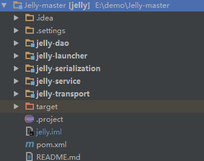

# 项目结构

项目结构如下图所示：

Jelly-master是工程包，管理jar版本、第三方插件

Jelly-dao数据层，集成Mybatis框架、Spring配置文件、Redis配置、定时任务配置

Jelly-launcher入口控制层，处理各种请求及分发到不同的业务接口

Jelly-serialization处理压缩、加密处理二进制数据流

Jelly-service业务逻辑层，处理具体的游戏业务逻辑

Jelly-transport处理网络通信、Netty编码解码、通信连接池、消息处理队列

